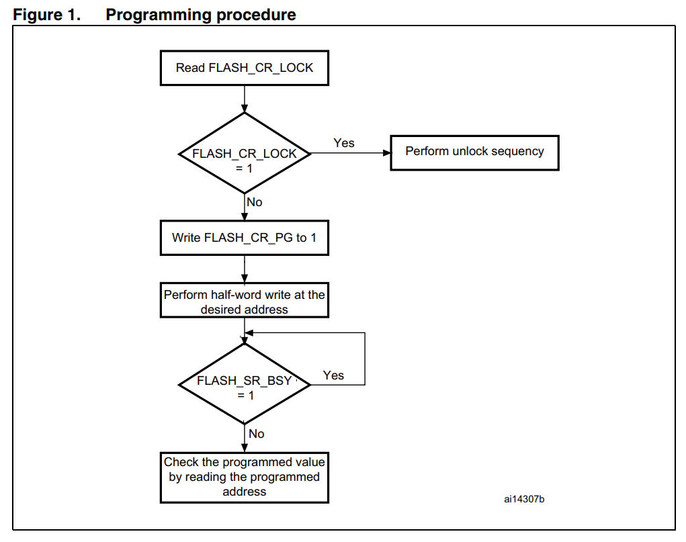

# Central Locking System

**The Hardwre consists of:**

   1. STM32F103C8T6 microcontroller
   2. Arduino UNO acts as the transmitter of the keyless entry system.
   3. Buttons act as mechanical kay to the car.
   4. Button connected to the transmitter (Arduino) as the remote key
   5. Alaram system (buzzer and LED)
   6. Buttons act as any of the inner door handles.
   7. The switch acts like any of the outer door handles.

**The Software consists of:**

   1. central_lock.c and central_lock.h
   2. HAL_flash.c and HAL_flash.h

**The features provided by the module are:**

   1. Lock and unlock the car mechanically.
   2. Lock and unlock the car remotely (keyless).
   3. Alarm in case of any threat.

## Overview for the module

1. **Purpose and benefit:**

   - Vehicle Central locking has the sole purpose of ```locking or unlocking``` all the doors in the car at the same time, via a ```remote``` or when the ```driver door locks```. It is a convenience feature, as well as a safety and security feature.

2. **How does a central locking system work :**

   - Central locking works on the basis of key codes and radio waves. In simple terms, the working of a central locking system can be explained like this - The car key acts as a transmitter and the car acts as a receiver. Whenever there is a command from the key, the car would respond to it. However, only if the codes of the receiver and transmitter match, will the car respond to the command.

   - Also, if the car is locked using the key, the immobiliser goes off. The immobiliser is a safety device in engines to prevent the car from being stolen by turning off the engine on the command of the transmitter, or the key.

4. **Auto-lock:**

   - This feature is a safety measure taken by automobile companies. This feature locks all the doors of the car, as soon as the first gear is engaged, so that young children don’t accidentally open the door while the car is not stationery.

   - However, not all cars have this feature. Some cars have speed sensing door locks, which is essentially the same thing, but the doors are locked when the car breaches a defined speed. Generally, the defined speed is 10 km/h, or around 6 m/h.

# I Learned more about

## 1. Debugging

I needed to use the dubugging feature all the time to see the data in different buffers and monitor the variables and the return status of different operations. And that makes it easier to discover any errors that occurred during the development. Also, it helped me to see the content of the registers to be aware of the current state of the MCU and check if the change that I made took place or not. The debugging was very helpful for me in this project.

## 3. SysTick timer in STM32F103C8T6

I needed a stage in the code to know the time according to the processor, so after sailing through the STM32F103C8T6 drivers provided by STM and some searching, I found that I could use the SysTick timer to know the time according to the processor.

## 3. Dealing with flash memory in STM32F103C8T6 and Arduino UNO

In a stage in the code, I nedded to use the flash memory in STM32F103C8T (STM32F103C8T6 does not have an EEPRM) and the EEPROM in Arduino. So I developed a ```HAL_flash``` module (.c and.h) for the STM32F103C8T6 to make it easier to use the permanent storage. This module provides the basic flash functions like read, write and erase. In Arduino, the module already exists in the arduino framework.


## 4. Callback function

A callback function is a function that is passed as an argument to another function, and it is called at a later time to complete some kind of action.

## 5. Sleep mode

There is no need to consume power while the central lock module is idle. So I used the sleep mode to save the power.

# The challenges I needed to deal with

## Syncrhonozation between TX and RX

When I tried to use this function ```HAL_UART_Receive_IT(&huart1, CodeBuffer, CODE_LENGTH);``` to receive the 6 bytes from the key, I encountered a problem. If there is an error while sending, like a byte didn't reach the RX UART, For example, if this byte is the 3rd byte, Then the 4th byte will be placed in the location of the 3rd byte. This is the problem. So I can't depend on this feature from the provided UART driver, and I should receive each byte alone and use the sequence numbers mechanism to check if the incomming byte is the write byte or not, and if so, I will place it in its right location. If it was not the expected byte, I will reset the sequence.

After more thinking, it is more logical to use the feature provided by the CubeIDE and let the responsibility of receiving all the code bytes rest on it. I will finally check for the correctness of the code. If it was correct, I would use it and then clear the buffer. If Iw was not correct, I will send ```NOT_ACK``` to the sender to make him resend.

## Debouncing problem

I handled this issue using a function called ```millies``` that calculates the milliseconds since the MCU started. I made a variable that carries the time of the last time the interrupt button was pressed. Let's call it ```prev```. When there is an interrupt, I will compare the value of ```prev``` with the value of the current time from the '''millies''', and if the difference is greater than, say, 200 ms, then it is definitely a debouncing effect, so ignore this interrupt.

I wrote this function in the STM32F108C8T6 MCU myself. The idea was using the SysTick timer. This timer is triggered to call a certain function every 1 ms because it runs on 1 KHz by default. Within this function, a variable is incremented. So I use this variable inside my ```millies``` function to get the time elapsed since the MCU started. Surprisingly, when this variable overflows, it will return to zero.

But this function is built-in in the Arduino framework.

## Difference in operatin voltages in the two UART modules

I am using the STM32F108C8T6, which operates at 3.3V, and the Arduino UNO, which operates at 5V. So by logic in need a level shifter to shift the 5V to 3.3V, but they work together normally in serial communication without any problems.

## Store data permanently

There is a number that I need to use in the code. And this number need not be reset to zero each time the MCU is on, so there must be a way to store its value permanently. You used the EEPROM inside the Arduino Uno that acts like a key to store this value.

In STM32F103C8T6, it is more complex. The flash memory here is a very big deal and I needed to understand this memory here before using it.

**In the STM32 the flash memory is devided into two sections:**

1. ```Main memory block:``` where we can store the firmware. With blue pill it is 64KBytes or 128KBytes.
2. ```Information block:``` Stores the bootloader and optional bytes.

**The main Flash memory can be programmed 16 bits at a time.**

**Flash memory interface (FLITF) features:**

1. Read interface with prefetch buffer (2 × 64-bit words)
2. Option byte Loader
3. Flash Program / Erase operation
4. Read / Write protection
5. Low-power mode

**The main Flash memory programming sequence in standard mode is as follows:**

1. Unlocking the Flash memory.
2. Check that no main Flash memory operation is ongoing by checking the BSY bit in the FLASH_SR register. The registers are not accessible in write mode when the BSY bit of the FLASH_SR register is set.
3. Set the PG bit in the FLASH_CR register(Flash programming chosen.).
4. Perform the data write (half-word) at the desired address.
5. Wait for the BSY bit to be reset.
6. Read the programmed value and verify.



**The main Flash memory erase sequence in standard mode is as follows:**

1. Unlocking the Flash memory.
2. Check that no Flash memory operation is ongoing by reading the BSY bit in the FLASH_SR register
3. Set the PER bit in the FLASH_CR register(Page Erase chosen)
4. Program the FLASH_AR register to select a page to erase 5. Set the STRT bit in the FLASH_CR register(This bit triggers an ERASE operation when set. This bit is set only by software and reset when the BSY bit is reset.)
5. Wait for the BSY bit to be reset
6. Read the erased option bytes and verify
